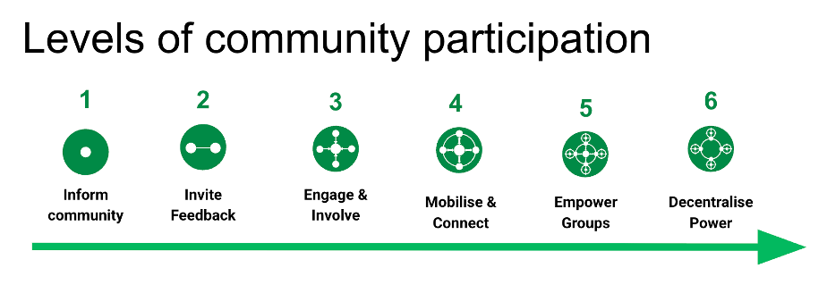
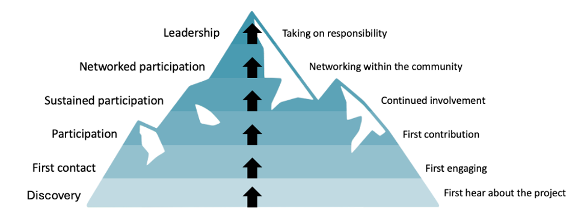
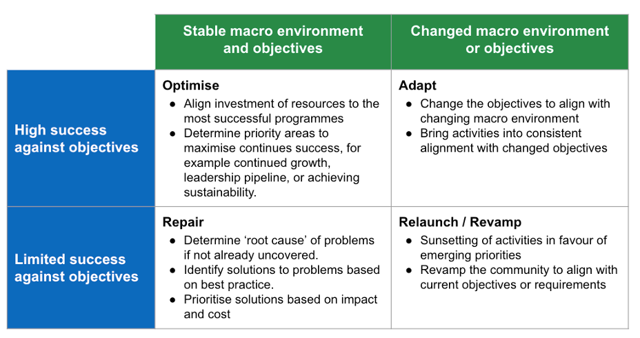

# Proposal for Open Scientist in Residence Program (OSRP) 2025
Cassandra Gould van Praag, Executive Director, RCM Cooperative
Approved August 2025

# Table of Contents
[1. Context](#context)

[2. Plan of Work](#plan-of-work)

[3. Deliverables and timeline](#deliverables-and-timeline)

[4. Budget and resourcing](#budget-and-resourcing)

[5. References](#references)

# Context

The Tanenbaum Open Science Institute (TOSI), have been actively engaged in activities to foster the adoption of open science practices at The Neuro (Montreal Neurological Institute-Hospital) and beyond since 2016. 
The mission is to:

1.  Establish best practices, develop tools, and develop infrastructure to support open science at The Neuro;

2.  Encourage and support other Canadian neuroscience Institutes to embrace this new way of doing research.

Their activities have influenced the development of multiple open (neuro) science institutes throughout Canada, and there is a further opportunity to share their experience to support the adoption of open science practices by other institutes at McGill University.

To date TOSI have supported a broad range of initiatives including:

- The development of large-scale data sharing infrastructure, for example C-BIG.
- Financial rewards and institutional recognition for participating in and developing open science resources, appropriate to multiple career stages and engagement levels.
- Trainee (student and Post-doctoral researcher) led initiatives such as the Open Science Research Fair, to inform and connect the open science student community (delivered by the TOSI Trainee Council (TC)).
- Workshops and resources to build capacity in open science best practice (Open Science Office Hours (OSOH), led primarily by TC).
- Open Science Helpers Program, providing hands-on “apprentice” support for the application of best practice in individual research projects.
- The formation of a grassroots committee to connect with local open science advocates (Open Science Grassroots Initiatives Committee (GRC)).
- An extended (3-4 month) residency to bring in established external members of the open science community, fostering cultural exchange (Open Science Residency Program (OSRP)).
- Patient engagement initiatives, to improve patient experience and help researchers better understand the needs of their community.

There has been variable uptake and success of these initiatives, and indications that the best practices of open science are failing to reach the full spectrum of staff members, students and researchers at The Neuro. Recent qualitative research (ongoing) suggests that there is variability in the awareness of resources available and siloing of participation in open practices.

The aim of this proposal is to develop an expert community strategy which supports the mission of TOSI, incorporating evidence and understanding gained over the last nine years of their operations.

# Plan of Work

We propose a formal analysis of the success of TOSI activities from 2014 to present, and development of both short- and longer-term strategic goals to support their mission. We will specifically focus on the health and sustainability of the open science community at The Neuo, with the understanding that community participation can positively contribute to successful behavior adoption.

The strategic analysis will be undertaken over four phases, as described below. The ‘diagnosis’ and ‘strategy design’ phases are expected to be the core undertakings of the residency period, with additional time allocated to co-creating ‘implementation tactics’ and ‘dissemination and engagement plans’ towards the end of the residency.

## Diagnosis

The aim of this phase is to define a clear set of objectives for the community, a set of quantitative and qualitative metrics to measure success against these objectives, and understand the efficacy of current activities in support of these objectives.

First we will document the organizational priorities with respect to desired modes of community participation (Sharan et al, 2024, see Figure 1 below). The **objectives for the community (Deliverable 1)** will be positioned within the macro environment of wider institutional priorities, resourcing forecasts, and trends within the discipline, country/region, and sector, including in TOSI Approved Open Science Institutes. This understanding will be built through qualitative interviews, desk research and workshop(s) with TOSI leadership and community representatives. We will importantly note whether these objectives have changed since the initiation of activities or have remained stable, to determine the appropriate strategy approach for moving forwards (see Section 2.2).

*Figure 1: Levels of community participation. The complexity of potential problems solved increases with increasing participation level, along with the scope and potential rate of problem solving, sustainability and diversity of perspectives which can be included. Increasing participation level also requires increased infrastructure and resourcing to deliver efficiently and with consistency. Level descriptions: (1) Inform: The community is a communications channel; (2) Invite feedback: The community shares opinions with you; (3) Engage & Involve: Leaders connect to collaborate, share practices and combine solutions; (4) Mobilize & Connect: Different groups within the community are interconnected; (5) Empower groups: Groups undertake activities aligned with the community purpose; (6) Decentralize power: Shared decision making and distribution of responsibilities. (Sharan et al, 2024).*

Once the objectives for the community have been established, we will determine which factors can be used to measure success against these objectives in the **current state (baseline), and uncover trends in these factors over time (Deliverable 2)**. Analysis will include evidence for different participation levels, observable behavior change (for example number of open science outputs), the community membership via a community map (Gould van Praag, 2025), and the community experience. We will review existing and past initiatives for the appropriateness of activities with respect to the stages of community building (Sharan *et al*., 2024, see Figure 2 below) and their sustainability by reference to the Mountain of Engagement model (Gould van Praag, 2022, see Figure 3 below). Evidence gathering will include quantitative assessment of engagement (for example event registration lists) and qualitative interviews and/or workshops where appropriate. The specific nature and quality of the quantitative data available will determine the extent to which this can form a substantial part of the analysis.

*Figure 2: Stages of community building: Community activities should be targeted and appropriate for the desired level of community participation. For example, where it is intended that a community is decentralized, the initiation roadmap should be regularly updated by the community, and working groups should be operating independently and collectively with agency. Stage descriptions: (1) Initiation: Share information and communicate project goals; (2) Planning &amp; Design: Build stakeholder awareness plans and prioritize specific objectives; (3) Implementation: Provide collaborative opportunities for specific stakeholders; (4) Growth &amp; Scaling: Facilitate knowledge exchange and skill building; (5) Monitoring &amp; Evaluation: Assesses success and refine strategy; (6) Sustainability/Sunsetting: Review sustainability, close or future iterations.*

*Figure 3: Mountain of Engagement. This model conceptualizes how people will interact with and contribute to a community, to build understanding of how different people might grow from their first interaction to taking on some form of responsibility. Not all community members will progress to leadership, but an understanding of the path leadership is particularly important in research communities where contributions are primarily voluntary. Here community managers should be aware of the leadership pipeline to ensure sustainability of delivery. Adapted from Mozilla Open Leaders Programme (https://www.mozillafoundation.org/).*

## Strategy design

Once analysis of the current (and forecast) state is complete, we will have a clearer picture of what activities are performing well to achieve the community objectives, and which areas which should be prioritised or adapted to support the objectives. This understanding will enable the **design of a strategy to support delivery of the TOSI mission going forwards** **(Deliverable 3)**.

The design is anticipated to support one of four broad strategic approaches for the entire programme (see Figure 4), and specific strategy recommendations may be made for individual initiatives.

*Figure 4: Strategic approaches for development of TOSI and The Neuro Open Science Community. The appropriate approach of ‘optimize’, ‘adapt’, ‘repair’ or ‘relaunch/revamp’ will be determined through consideration of how successful the overall programme and individual activities have been in achieving the devised objectives, and whether the macro environment of TOSI or the objectives themselves have changed since 2014. Adapted from Millington (2025).*

Across all approaches we will emphasize the need to embed ongoing data collection and monitoring of factors identified as relevant to success, along with regular review of the objectives and mechanisms to remain responsive to changes in the macro environment.

## Implementation tactics

In this phase we will co-create implementation tactics to enable delivery of the strategy. These may be high level or specifically targeted depending on the approach or results of diagnosis. The intentional co-creation of these tactics with community members, leaders and the delivery team will (i) ensure that they are grounded in the needs in context of the community, and (ii) empower the community to take ownership of activities, providing agency and accountability. We will review proposed implementation plans against potential impact and investment, and the potential for success given the success of similar activities in the same or similar contexts. We may propose both short-and long-term activities, dependant on the level of appetite for risk and resource capacity. Importantly, we will practice the desired level of community participation in development of the implementation tactics, to ensure that this essential activity sets the intention for community work going forwards. That is, if it is desired that the community is empowered to work in groups or decentralized, then this stage must also be delivered by empowered or decentralized groups. We will again emphasis the importance of data collection to monitor the success of initiatives, and work to define and optimize data collection processes as part of tactic proposals.

## Dissemination and engagement planning

For the strategy and objectives to be successful, it is essential that they are well understood and accepted by leadership, the delivery team and the wider community. Endorsement of the strategy will be facilitated by the specific engagement of those groups at all stages of this analysis and ideation, and their perceptions of this work to be supporting their needs and priorities. We will work with groups to identify opportunities to integrate the strategy into appropriate levels of planning and operations across the organization. We will also work with researchers and leadership to understand what opportunities and resources may support them in both internal and external engagement.

# Deliverables and timeline

## Schedule of work

The OSRP is envisaged to take place September-December 2025 (12 weeks) at 0.5FTE. The below schedule outlines the expected timescale for delivery of the key outputs described above. A more detailed roadmap will be developed and communicated throughout the project. Together these deliverables will be collated into a detailed report containing a concrete analysis of all TOSI programs and strategy, and the community needs, and concrete recommendations for improving our programs (and creating new ones or eliminating them, if necessary). 

<table>
<caption>
<b>Table 1: Schedule of deliverables for OSRP 2025.</b>
</caption>
<colgroup>
<col style="width: 27%" />
<col style="width: 43%" />
<col style="width: 28%" />
</colgroup>
<thead>
<tr>
<th>Deliverable</th>
<th>Purpose</th>
<th>Delivery timescale</th>
</tr>
</thead>
<tbody>
<tr>
<td>1. Objectives for the community</td>
<td>Defines current and desired future state of the community, along with measure of success.</td>
<td>Week 1-2</td>
</tr>
<tr>
<td>2. Baseline and trends in success against objectives</td>
<td>Demonstrates how the community is currently performing with respect to desired levels of participation, with evidence of appropriate and sustainable activity.</td>
<td>Week 3-6</td>
</tr>
<tr>
<td>3. Strategy design</td>
<td>Agree upon appropriate approach to support success against objectives going forwards.</td>
<td>Week 7-8</td>
</tr>
<tr>
<td>4. Implementation tactics</td>
<td>Co-creation and prioritization of activities (or refinement of activities) to achieve the strategy.</td>
<td>Week 8-10</td>
</tr>
<tr>
<td>5. Dissemination and engagement plan</td>
<td>Empower the community to raise awareness of the strategy, so it can be incorporated in operations planning.</td>
<td>Week 10-12</td>
</tr>
</tbody>
</table>

## FAIR outputs

Aligned with the mission and practices of RCM Cooperative, all outputs will be released under a CC-BY-4.0 license for documentation and an MIT license for code. This will provide TOSI full permission to remix and reuse materials as they see fit, with acknowledgement to RCM Cooperative and the community members who have contributed to their development.

All analysis and strategy proposals will be submitted to TOSI over an agreed timescale through professional reports and data. All data analysis will be FAIR and computationally reproducible where possible. All activities will be undertaken with high regard for and expertise in delivering equitable, diverse and inclusive participation, noting that this is an essential component of effective engagement and collaboration.

# Budget and resourcing

## Responsibilities

The main investigative work will be undertaken by Cassandra Gould van Praag (RCM Cooperative), using infrastructure provided by RCM Cooperative. Where engagement with the community is required, for example for qualitative data collection and the co-creation of recommendations, we require that TOSI facilitate connections with appropriate individuals and manage the logistics of convening (for example, registration and room bookings for workshops). A more complete alignment on shared responsibilities for the delivery of this proposal will be determined at the outset.

## Project infrastructure

It is our preference to undertake project work using GitHub as the core delivery infrastructure. This ensures best practice in transparency and accountability, in line with best practice in open science. We also recognize GitHub and other similar platforms to provide excellent infrastructure for decentralized group project management, facilitating rapid integration among disbursed teams. We would be pleased to work within a GitHub repository provided and maintained by RCM Cooperative, or a repository space provided by TOSI.

We understand any requirement for experience with GitHub may limit engagement, therefore we will work to minimize requirements for technical expertise in this infrastructure where they are not absolutely essential for the success of the project. We are also pleased to work with any local capacity building initiatives to support on boarding with GitHub infrastructure where required.

## Budget

As discussed, we would be pleased to undertake this work at a reduced pre-tax rate, plus additional overheads charged by [OLS](https://we-are-ols.org/) as the fiscal sponsor of RCM Cooperative. The invoice for services will be prepared and submitted to TOSI (or relevant parties) by OLS. 

# References

Gould van Praag, C. (2022). The role of Community in FAIR Neuroscience. Zenodo. <https://doi.org/10.5281/zenodo.6816230>

Gould van Praag, C. (2025). RCM Cooperative Community Mapping Workflow. Zenodo. <https://doi.org/10.5281/zenodo.15320348>

Millington, R. (2025). How to develop a community strategy. FeverBee. Retrieved from <https://www.feverbee.com/strategy/>.

Sharan, M., Karoune, E., Hellon, V., Gould van Praag, C., Kayumbi, G., Bennett, A., Araujo Alvarez, A., Steele, A., Batchelor, S., Lacey, A., Whitaker, K. (2024). Professionalising Community Management Roles in Interdisciplinary Research Projects. <https://doi.org/10.48550/arXiv.2409.00108>
